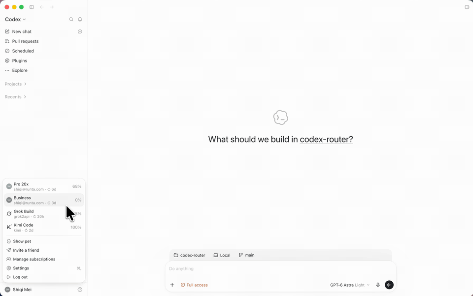

<p align="center">
  
</p>

<p align="center">
  <a href="assets/CodexRouter.mp4"><strong>Watch the 17s demo</strong></a>
  &nbsp;·&nbsp;
  macOS · Apple silicon
</p>

# CodexRouter

**Use all your coding-plan subscriptions in your favorite Codex desktop.**

Auto-rotate accounts when the weekly quota is reached. Stay in the same thread.

You already pay for more than one coding plan — Pro, Business, Grok, Kimi, whatever Codex can talk to. The official desktop only signs into one of them. Hit the weekly cap and the conversation stops.

CodexRouter is that same Codex UI, as a **separate app on your Mac**, with every subscription and native provider in the profile menu. When one account is out of weekly quota, the next turn continues somewhere that still has room.

| | Official Codex desktop | CodexRouter |
| --- | --- | --- |
| Logins | One ChatGPT account | Every subscription you add |
| Weekly cap | The thread dies | Fail over to the next account |
| Other models | Leave the app | Grok, Kimi, any native Codex provider |
| Switching | Start a new chat | Same thread, history copied, turn continues |
| Official app | — | Never modified |

<p align="center"><sub>The banner is an animated GIF named <code>banner.png</code> so it can sit in the README. GitHub often shows only the first frame because the filename ends in <code>.png</code>. Open <a href="assets/CodexRouter.mp4">assets/CodexRouter.mp4</a> if the image does not play.</sub></p>

## Use it

One prompt. Point your coding agent at **this repository** and paste:

```text
Adapt the official Codex desktop already installed on this Mac into a separate local app, CodexRouter. Read this repository first and reuse its code. Do not redesign the multiplexer.

Clone or open this repo, then:

1. Build ~/Applications/CodexRouter.app from the local /Applications/ChatGPT.app. Never edit, replace, or redistribute the official install, its ASAR, or any OpenAI binary. Do not commit credentials, ~/.codex, ~/.superior, or provider secrets.

2. Reuse these paths instead of rewriting them: cmd/codex-mux, internal/mux, internal/state, internal/provideradapter, ui/, scripts/build_superior.py. Keep the MIT attribution to b-nnett/codex-subscription-router in NOTICE.md and LICENSE.

3. Support many ChatGPT coding-plan subscriptions and native Codex providers in one desktop. A provider is native Codex config: model, model_provider, and [model_providers.<id>], plus optional environment variables stored privately and injected only into that provider's Codex process.

4. Put connections in the bottom-left profile menu: remaining quota, add subscription (device-code login), add / edit / delete provider, enable or disable, switch the active connection. API providers must not show a made-up ChatGPT percentage. New chats pick the best enabled connection by weekly urgency. Skip accounts already at 100% on the weekly window or the short window. This is not random round-robin.

5. Allow a switch inside an existing thread. Copy the drained history to the target home, keep the thread id, and continue the turn there. If resume fails, restore the source. Do not start a blank chat.

6. Auto-rotate when quota is exhausted. If a turn fails with a quota, usage-limit, rate-limit, or out-of-credits error, fail over to another enabled connection and cool the failed account down for 5 minutes. Do not auto-replay arbitrary tool failures. Interrupted shell commands may already have side effects; only conversation state is preserved.

7. Stay on the desktop build this repo pins (26.915.31945 / build 9922, including its ASAR hash and menu anchors) unless you re-verify those anchors. Unknown builds must stop before install. Self-update stays disabled in the copy. Account data under the existing Superior profile must survive a rebuild.

8. Build with:
   npm ci --ignore-scripts && npm run build:desktop
   Then open ~/Applications/CodexRouter.app.

If this checkout is already CodexRouter, install and verify it. Do not invent a second design.
```

That is the whole install path: your agent reads this repo, reuses the mux, and patches a **copy** of your ChatGPT app. You do not run a from-scratch integration.

After it launches, open the profile menu (bottom-left):

- **Add another subscription** — Codex device-code login.
- **Add provider** — paste native `model` / `model_provider` config. Secrets stay on disk, not in the UI.
- Pick a connection for a new chat, or switch one mid-thread. The demo does this: the thread hits "You've hit your usage limit", then continues on another provider with history intact.

## What you actually get

- **One Codex UI for every plan you pay for.** Subscriptions and native providers show up as connections, with weekly remaining quota where the upstream reports it.
- **Auto-rotate when the weekly quota is reached.** Accounts at 100% weekly or short-window usage are skipped. A quota / usage-limit / rate-limit / out-of-credits failure fails over and sits out for five minutes. The next new chat prefers the connection with the most weekly headroom, not a random spin.
- **Switch without losing the thread.** Idle threads keep their history. A running turn is interrupted, its rollout is copied, and work continues on the connection you picked. You steer from the normal composer.
- **Your official app stays official.** The build copies `/Applications/ChatGPT.app`, signs that copy, and disables its self-update. Source only — do not ship the patched app or OpenAI binaries.

Requirements: macOS Apple silicon, Go 1.26+, Node 22.12+, Python 3.11+, Xcode command-line tools, and ChatGPT already installed at `/Applications/ChatGPT.app`. The patch is pinned to desktop **26.915.31945 / build 9922**. A different build stops before install.

```sh
npm ci --ignore-scripts
npm run build:desktop
open "$HOME/Applications/CodexRouter.app"
```

Ad-hoc signing is enough for the routing flows tested on the development machine. Pass `--identity` only if you have a local cert; it does not by itself make Computer Use helpers work on a fresh Mac.

```sh
python3 scripts/build_superior.py --identity "Apple Development: Your Name (TEAMID)"
```

Quit CodexRouter before replacing a running build. Existing installs are backed up. Account data survives. `Superior.app` remains a compatibility symlink so cached tool paths keep working. Bundle id and `Application Support/Superior` stay as they are on purpose.

## How a turn moves

```text
Codex desktop UI  →  codex-mux
                     ├─ official Codex + primary ~/.codex
                     ├─ official Codex + isolated subscription home
                     └─ official Codex + native provider config
```

Routing state is `~/.superior/state.json`. Extra homes and provider config live under `~/.superior/accounts/<id>/codex-home`. Credentials are not returned by the account API. Primary credentials stay in `~/.codex`.

A handoff waits out the active turn, copies a portable rollout into the target home, resumes the same thread id, and commits the new owner. Failure before commit restores the source. Account-bound encrypted reasoning is stripped so it is not forwarded to another provider. A continued turn gets a new turn id; in-flight steering for that handoff is remapped. Older copies stay on disk, but only the committed owner is listed.

Explicit quota errors take that same path. Anything that is just a tool failure is shown to you and not replayed.

Native provider example:

```toml
model = "your-model"
model_provider = "custom"

[model_providers.custom]
name = "Custom"
base_url = "https://your-provider.example/v1"
wire_api = "responses"
env_key = "PROVIDER_API_KEY"
```

Put `{"PROVIDER_API_KEY":"..."}` in the provider's environment field. Desktop apps do not inherit `.zshrc`. Leave the field blank on edit to keep stored secrets, or send `{}` to clear them. The config is trusted local Codex configuration, including any credential helper it names. Protocol and model support come from **your** installed Codex binary — CodexRouter does not invent a second model protocol.

Each provider can also own a private `models.json` catalog (`model_catalog_json`). `catalogs/grok2api.models.json` is the local grok2api catalog. The configured default model must appear in that catalog.

## Quota badges

- **ChatGPT subscriptions** — weekly remaining from Codex rate-limit windows, same idea as the upstream account rows.
- **Grok / local grok2api** — weighted weekly remaining from that instance's account billing snapshots: `sum(weight × remaining%) / sum(weight)`. Same tier defaults to equal weight; optional `accountWeights` can bias capacity. Missing or expired weekly snapshots stay unavailable instead of being dropped. The tooltip adds cumulative tokens (`SUM(total_tokens)` from `request_audits`, via `sqlite3 -readonly`, never double-counting cached input) and the quota sync time. That token count is every retained audit row on the service, not only CodexRouter traffic, so a narrower dashboard filter will not match. No admin credentials. Bind it in `~/.superior/provider-metrics.json` as `{"type":"grok2api-sqlite","baseUrl":"http://localhost:8000/v1","databasePath":"/absolute/path/to/backend.db"}`. If the endpoint no longer matches, the local badge goes away. A database that cannot be read shows a dash, not a fake zero.
- **Kimi Code** — official `api.kimi.ai` / `api.kimi.com` coding hosts only. Weekly remaining comes from `/coding/v1/usages` (`usages.limit_7d.used_ratio`, or the legacy weekly limit). The 5-hour window is not substituted for the weekly number. Redirects are rejected.
- **Everyone else** — an API badge. Missing credentials or a bad response means "unavailable", not 0% or 100%.

`internal/provideradapter` is the extension point: `Match` + `Read` → a shared `Usage` value. The mux caches and dedupes; the menu only formats.

## Check your build

```sh
npm run check       # race-enabled Go tests, vet, JS and Python syntax
npm run test:e2e    # real official app-server, isolated homes, scripted providers
npm run test:live   # opt-in, spends real quota on canary chats only
```

`test:live` copies existing local credentials into private temp homes and deletes those copies when it finishes. It never sends your real conversations. Details, Computer Use limits, and what is intentionally not claimed: [docs/VALIDATION.md](docs/VALIDATION.md), [docs/COMPUTER-USE-REGRESSION.md](docs/COMPUTER-USE-REGRESSION.md).

Design notes: [docs/ARCHITECTURE.md](docs/ARCHITECTURE.md). Files in `docs/upstream` are historical reference, not current claims.

## Credit and boundaries

The multiplexer, subscription login, and account menu started as MIT code from [b-nnett/codex-subscription-router](https://github.com/b-nnett/codex-subscription-router). Provenance is in [NOTICE.md](NOTICE.md). This repo adds provider profiles, explicit routing, mid-thread handoff, quota failover, and the desktop patch for build 9922.

CodexRouter is not affiliated with OpenAI. ChatGPT, Codex, and OpenAI names are used only to say what this copy talks to. You are responsible for the terms of the ChatGPT app on your machine and of every subscription you connect.

Do not open a pull request that adds API keys, account homes, or a built `CodexRouter.app`.
